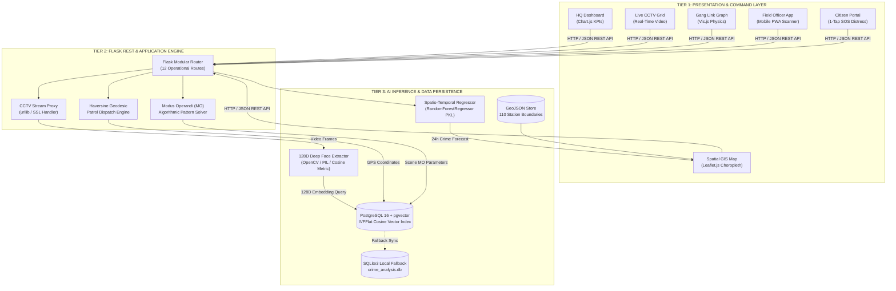

# 🏛️ SYSTEM ARCHITECTURE, OPERATIONAL WORKFLOW & DATABASE (ER) DIAGRAMS
## Smart Crime Intelligence, Real-Time CCTV AI Surveillance & Predictive Policing Command System
**B.E. Information Technology — Final Year Project Review 1 Master Technical Design Document**

---

## 📑 TABLE OF CONTENTS
1. [System Architecture Diagram (3-Tier High-Level Design)](#1-system-architecture-diagram)
2. [End-to-End Operational Workflow Diagram](#2-end-to-end-operational-workflow-diagram)
3. [Database Entity-Relationship (ER) & Schema Diagram](#3-database-entity-relationship-er--schema-diagram)
4. [Component-Level Interaction & Data Flow Specifications](#4-component-level-interaction--data-flow-specifications)

---

# 1. SYSTEM ARCHITECTURE DIAGRAM

The system follows a decoupled, enterprise-grade **3-Tier Layered Architecture** separating the **Presentation Layer (Frontend UI/PWA)**, the **Application & Orchestration Layer (Flask WSGI Server & Core Services)**, and the **AI Inference & Data Persistence Layer (Computer Vision, ML Regressor & PostgreSQL `pgvector`)**.

### 📐 1.1 Visual Layered Architecture (ASCII Box Diagram)

```
========================================================================================================================
                                     TIER 1: PRESENTATION & CLIENT COMMAND INTERFACE
========================================================================================================================
  [ Control Room Operator ]        [ Field Beat Constable ]         [ Crime Investigator ]        [ Citizen / Public ]
             │                                │                                │                           │
             ▼                                ▼                                ▼                           ▼
  ┌───────────────────────┐        ┌───────────────────────┐        ┌───────────────────────┐   ┌──────────────────────┐
  │   COMMAND HQ PORTAL   │        │   MOBILE FIELD PWA    │        │  INVESTIGATION PORTAL │   │  CITIZEN SOS PORTAL  │
  │  • KPI Metrics Cards  │        │  • Camera Face Scan   │        │  • Criminal Dossiers  │   │  • 1-Tap SOS Panic   │
  │  • CCTV Video Grid    │        │  • Proximity Radar    │        │  • MO Pattern Solver  │   │  • Anonymous Crime   │
  │  • GIS Choropleth Map │        │  • GPS Fleet Telemetry│        │  • Gang Vis.js Graph  │   │    Tip Submission    │
  │  • Patrol Unit Tracker│        │  • Radio Task Alert   │        │  • FIR Vault Audit    │   │  • Emergency Status  │
  └───────────────────────┘        └───────────────────────┘        └───────────────────────┘   └──────────────────────┘
             │                                │                                │                           │
             └────────────────────────────────┼────────────────────────────────┴───────────────────────────┘
                                              │  HTTPS / REST APIs / Multipart MJPEG Video Streams
                                              ▼
========================================================================================================================
                              TIER 2: APPLICATION, ORCHESTRATION & BUSINESS LOGIC LAYER
                                            (Python 3.11 / Flask WSGI Core)
========================================================================================================================
  ┌──────────────────────────────────────────────────────────────────────────────────────────────────────────────────┐
  │                                           FLASK MODULAR ROUTING ENGINE                                           │
  │   /dashboard   •   /cctv-surveillance   •   /face-recognition   •   /police-patrols   •   /network-graph         │
  │   /fir-vault   •   /crime-pattern       •   /proximity-scanner  •   /risk-predictor   •   /citizen-portal        │
  └──────────────────────────────────────────────────────────────────────────────────────────────────────────────────┘
            │                                         │                                           │
            ▼                                         ▼                                           ▼
  ┌───────────────────────┐                 ┌───────────────────────┐                   ┌────────────────────────┐
  │  STREAM PROXY ENGINE  │                 │   TACTICAL DISPATCH   │                   │  INTELLIGENCE SOLVERS  │
  │  • RTSP / IP Demuxer  │                 │  • Haversine Distance │                   │  • Multi-Param MO      │
  │  • SSL/BasicAuth Parse│                 │    Matrix Calculator  │                   │    Attribute Matcher   │
  │  • Non-blocking MJPEG │                 │  • Closest-Unit Finder│                   │  • Graph Syndicate     │
  │    Frame Forwarder    │                 │  • SOS Broadcast Queue│                   │    Adjacency Traversal │
  └───────────────────────┘                 └───────────────────────┘                   └────────────────────────┘
            │                                         │                                           │
            └─────────────────────────────────────────┼───────────────────────────────────────────┘
                                                      │
                                                      ▼
========================================================================================================================
                                TIER 3: AI INFERENCE & DATA PERSISTENCE LAYER
========================================================================================================================
  ┌───────────────────────────────────────────────────┐               ┌──────────────────────────────────────────────┐
  │                 AI & COMPUTER VISION              │               │            DATA PERSISTENCE ENGINE           │
  │                                                   │               │                                              │
  │  [ 128D Deep Facial Vector Extractor ]            │               │  [ PostgreSQL 16 + 'pgvector' Extension ]    │
  │  • OpenCV Facial Landmark Detector                │               │  • vector(128) Cosine Similarity Index       │
  │  • Affine Geometric Face Alignment                │  Vector Query │  • IVFFlat Accelerated Search (<120ms)       │
  │  • L2 Normalization into R^128                    │──────────────>│  • Relational FIRs, Criminals, Fleet         │
  │  • Cosine Similarity & Distance Matcher           │               │                                              │
  │                                                   │               │  [ Serialized ML Model Artifacts ]           │
  │  [ Spatio-Temporal Supervised Regressor ]         │               │  • crime_risk_model.pkl                      │
  │  • RandomForestRegressor (100 Trees)              │               │    (RandomForestRegressor + StandardScaler)  │
  │  • 14 Lagged Historical Features                  │               │                                              │
  │  • Predicts: future_24h_crime_count               │               │  [ SQLite3 Local Cache Fallback ]            │
  │  • Chronological Split (Zero Future Leakage)      │               │  • crime_analysis.db (Dev / Offline Mode)    │
  └───────────────────────────────────────────────────┘               └──────────────────────────────────────────────┘
========================================================================================================================
```

### 📊 1.2 System Architecture (Mermaid Diagram)



---

# 2. END-TO-END OPERATIONAL WORKFLOW DIAGRAM

The operational workflow illustrates how raw inputs—ranging from municipal CCTV camera streams and citizen SOS triggers to crime scene parameters—flow through the system to trigger real-time tactical actions.

### 🔄 2.1 Workflow Diagram (Mermaid Diagram)

```mermaid
sequenceDiagram
    autonumber
    actor CCTV as Municipal CCTV / RTSP
    actor Citizen as Citizen User
    participant App as Flask Command Server
    participant CV as 128D Face AI Engine
    participant DB as PostgreSQL (pgvector)
    participant ML as Crime Risk Predictor
    actor Police as Beat Patrol Fleet / Control HQ

    %% Workflow 1: Live Face AI Surveillance
    rect rgb(20, 30, 50)
    note right of CCTV: WORKFLOW A: Real-Time CCTV Surveillance & Face Recognition
    CCTV->>App: Ingest RTSP / MJPEG live camera stream
    App->>CV: Forward raw frame to AI Stream Proxy
    CV->>CV: Detect landmarks & crop affine-aligned face
    CV->>CV: Generate 128D floating-point vector V
    CV->>DB: Query vector using Cosine Distance (IVFFlat index)
    DB-->>CV: Return Top-K candidates (distance & metadata)
    alt Candidate Confidence >= 75%
        CV->>App: Fugitive Match Event Triggered
        App->>Police: Audio-visual siren alert with suspect dossier & camera ID
    else Candidate Confidence < 75%
        CV->>App: Normal frame pass (No warrant match)
    end
    end

    %% Workflow 2: Spatio-Temporal Future Crime Forecasting
    rect rgb(30, 45, 40)
    note right of ML: WORKFLOW B: Spatio-Temporal Crime Risk Forecasting
    App->>DB: Fetch historical 30-day FIR sliding-window metrics
    DB-->>App: Return lagged crime counts, IPC subtypes & calendar features
    App->>ML: Pass 14-dimensional feature vector X(t)
    ML->>ML: RandomForestRegressor evaluates 100 Decision Trees
    ML-->>App: Output predicted future_24h_crime_count & Risk Band
    App->>Police: Update Leaflet.js GeoJSON choropleth map (Low/Mod/High/Very High)
    Police->>Police: Redeploy beat patrol vans to high-probability sectors
    end

    %% Workflow 3: Citizen SOS Distress & Proximity Dispatch
    rect rgb(50, 25, 30)
    note right of Citizen: WORKFLOW C: Citizen Emergency Panic & Patrol Dispatch
    Citizen->>App: 1-Tap SOS Trigger (GPS Lat, Lng)
    App->>DB: Fetch active beat officers with duty_status='Active'
    App->>App: Compute Haversine Geodesic Distance matrix to incident
    App->>Police: Highlight nearest PCR patrol van on map
    Police->>Police: 1-Click Radio Dispatch command issued to officer vehicle
    end
```



### 📋 2.2 Operational Step-by-Step Execution Sequence

```
┌──────────────────────────────────────────────────────────────────────────────────────────────────────────────────────┐
│                                       TACTICAL INCIDENT LIFECYCLE (PHASES)                                           │
├──────────────────────────┬────────────────────────────────────────┬──────────────────────────────────────────────────┤
│ STAGE                    │ SYSTEM ACTION                          │ TECHNICAL MECHANISM                              │
├──────────────────────────┼────────────────────────────────────────┼──────────────────────────────────────────────────┤
│ 1. Continuous Ingestion  │ Ingests 24/7 video streams & FIRs      │ Stream Proxy demuxes frames without UI latency   │
│ 2. Facial Vectorization  │ Extracts 128D facial embeddings        │ OpenCV affine rotation + deep embedding norm     │
│ 3. Mathematical Query    │ Sub-120ms similarity match in DB       │ PostgreSQL pgvector Cosine metric (<=>)          │
│ 4. Threat Escalation     │ Broadcasts siren & populates dossier   │ WebSocket/SSE alert to Command HQ & Patrols      │
│ 5. Spatio-Temporal ML    │ Forecasts next 24-hour crime hotspots  │ RandomForestRegressor on 14 lagged features      │
│ 6. Geodesic Fleet Action │ Computes closest officer coordinates   │ Haversine distance solver -> 1-Click radio dispatch│
│ 7. Case Archival         │ Links FIR, recovered goods & MO tags   │ Relational foreign key binding to criminal ID    │
└──────────────────────────┴────────────────────────────────────────┴──────────────────────────────────────────────────┘
```

---

# 3. DATABASE ENTITY-RELATIONSHIP (ER) & SCHEMA DIAGRAM

The persistence layer is architected as an **Enterprise Relational & High-Dimensional Vector Schema** hosted on PostgreSQL with the `pgvector` extension (with SQLite3 fallback for local testing).

### 🗄️ 3.1 Entity-Relationship (ER) Diagram (Mermaid Diagram)

```mermaid
erDiagram
    CRIMINAL_RECORDS ||--o{ CRIME_RECORDS : "commits / accused_in"
    CRIMINAL_RECORDS ||--o{ FACE_RECOGNITION_DATA : "has_registered_embeddings"
    CRIMINAL_RECORDS ||--o{ CRIME_MODUS_OPERANDI : "exhibits_crime_style"
    AREA_CRIME_STATISTICS ||--o{ CRIME_RECORDS : "occurs_within"
    AREA_CRIME_STATISTICS ||--o{ POLICE_OFFICERS : "assigned_jurisdiction"
    AREA_CRIME_STATISTICS ||--o{ SOS_ALERTS : "originated_from"
    POLICE_OFFICERS ||--o{ SOS_ALERTS : "dispatched_to"
    AREA_CRIME_STATISTICS ||--o{ CITIZEN_TIPS : "reported_for"

    CRIMINAL_RECORDS {
        varchar criminal_id PK "Unique Criminal Identifier"
        varchar full_name "Full Registered Name"
        varchar nickname "Alias / Gang Nickname"
        varchar criminal_category "Organized Crime / Cyber / Property"
        varchar risk_level "LOW / MEDIUM / HIGH / CRITICAL"
        varchar gang_name "Syndicate / Gang Affiliation"
        varchar gang_role "Kingpin / Lieutenant / Enforcer"
        varchar preferred_weapon "Firearm / Knife / Cyber"
        int wanted_status "1 = Wanted Fugitive, 0 = Inactive"
        int active_status "1 = Active Offender, 0 = In Custody"
        text mugshot_image "Relative Path to Stored Image"
        timestamp created_at "Registration Timestamp"
    }

    FACE_RECOGNITION_DATA {
        int face_id PK "Auto-increment Face ID"
        varchar criminal_id FK "References CRIMINAL_RECORDS"
        text image_path "Mugshot File Path"
        vector_128 face_encoding "128D Deep Feature Vector (pgvector)"
        varchar capture_angle "Frontal / 45-deg Left / 45-deg Right"
        float confidence_score "Extraction Quality Confidence"
        date capture_date "Capture Date"
    }

    CRIME_RECORDS {
        varchar crime_id PK "Unique Crime Incident ID"
        varchar fir_number UK "Official FIR Identifier"
        varchar crime_type "Theft / Robbery / Cyber / Violent"
        varchar crime_subtype "Chain Snatching / ATM Heist / etc"
        date crime_date "Incident Occurrence Date"
        varchar crime_time "Occurrence Timestamp"
        varchar area_name "Local Jurisdiction Area"
        float latitude "GPS Latitude"
        float longitude "GPS Longitude"
        varchar weapon_used "Recorded Weapon"
        varchar entry_method "Grill Cut / Lock Pick / Unlocked"
        float property_loss_amount "Stolen Goods Value (INR)"
        varchar case_status "Solved / Unsolved / Under Investigation"
        int arrest_made "1 = Arrest Made, 0 = Pending"
        varchar criminal_id FK "References CRIMINAL_RECORDS"
        varchar police_station "Assigned Station Desk"
    }

    CRIME_MODUS_OPERANDI {
        int mo_id PK "Modus Operandi Record ID"
        varchar criminal_id FK "References CRIMINAL_RECORDS"
        varchar crime_type "Crime Classification"
        varchar entry_method "Method of Infiltration"
        varchar escape_method "Getaway Vehicle / Route"
        varchar target_selection "Commercial / Residential / Bank"
        varchar crime_timing "Nocturnal (02:00-04:00) / Day"
        varchar weapon_used "Specialized Weapon Signature"
        text repeat_pattern "Algorithmic Signature Notes"
    }

    AREA_CRIME_STATISTICS {
        int area_id PK "Jurisdiction ID"
        varchar area_name UK "Police Station / Locality Name"
        float latitude "Centroid Latitude"
        float longitude "Centroid Longitude"
        int total_crimes "Cumulative Recorded FIRs"
        float hotspot_score "Empirical Risk Score (1.0 - 10.0)"
        int night_crime_count "Night Incident Frequency"
        varchar most_common_crime "Dominant Offense Category"
        varchar dangerous_time "Peak Vulnerability Window"
        timestamp last_updated "Last Recalculation Time"
    }

    POLICE_OFFICERS {
        varchar officer_id PK "Badge / Employee ID"
        varchar officer_name "Officer Full Name"
        varchar rank "Constable / Sub-Inspector / Inspector"
        varchar badge_number UK "Official Service Badge No"
        varchar phone_number "Contact Telephony"
        varchar police_station "Current Station Assignment"
        varchar assigned_area "Assigned Beat Patrol Sector"
        varchar duty_status "Active / On Patrol / Responding / Off Duty"
        float latitude "Live GPS Telemetry Latitude"
        float longitude "Live GPS Telemetry Longitude"
        int solved_cases "Historical Clearance Record"
    }

    SOS_ALERTS {
        varchar alert_id PK "Unique Emergency SOS Alert ID"
        varchar area_name "Location of Panic Trigger"
        float latitude "Distress GPS Latitude"
        float longitude "Distress GPS Longitude"
        varchar assigned_officer_id FK "Dispatched Patrol Unit ID"
        varchar status "PENDING / DISPATCHED / RESOLVED"
        timestamp created_at "Distress Transmission Time"
    }

    CITIZEN_TIPS {
        varchar tip_id PK "Citizen Tip Reference ID"
        varchar area_name "Reported Locality"
        varchar crime_type "Reported Incident Category"
        text description "Whistleblower Narrative"
        text image_path "Uploaded Crime Scene Evidence"
        boolean anonymous "True = Conceal Identity"
        varchar status "SUBMITTED / VERIFYING / ESCALATED"
        timestamp created_at "Tip Submission Timestamp"
    }
```



---

# 4. COMPONENT-LEVEL INTERACTION & DATA FLOW SPECIFICATIONS

### 🔬 4.1 Facial Vector Persistence with PostgreSQL `pgvector`
The `face_recognition_data` table stores the core mathematical vectors powering the automated surveillance pipeline. Unlike traditional BLOB image storage, storing 128-dimensional floating-point arrays natively allows mathematical operators directly inside SQL:

```sql
-- Schema Definition with pgvector Extension
CREATE EXTENSION IF NOT EXISTS vector;

CREATE TABLE face_recognition_data (
    face_id SERIAL PRIMARY KEY,
    criminal_id VARCHAR(50) REFERENCES criminal_records(criminal_id) ON DELETE CASCADE,
    image_path TEXT NOT NULL,
    face_encoding vector(128) NOT NULL,
    capture_angle VARCHAR(50) DEFAULT 'Frontal',
    confidence_score FLOAT DEFAULT 1.0,
    capture_date DATE DEFAULT CURRENT_DATE
);

-- Inverted File Flat (IVFFlat) Cosine Distance Vector Index
CREATE INDEX face_encoding_cosine_idx 
ON face_recognition_data 
USING ivfflat (face_encoding vector_cosine_ops) 
WITH (lists = 100);

-- Sub-120ms Query Execution for Live Video Stream Matching
SELECT 
    f.criminal_id,
    c.full_name,
    c.risk_level,
    c.wanted_status,
    c.mugshot_image,
    (1 - (f.face_encoding <=> :query_vector)) * 100 AS confidence_percentage
FROM face_recognition_data f
JOIN criminal_records c ON f.criminal_id = c.criminal_id
ORDER BY f.face_encoding <=> :query_vector ASC
LIMIT 5;
```

### 🛰️ 4.2 Haversine Geodesic Closest-Patrol Dispatch Query
When an incident is reported at coordinate $(\phi_1, \lambda_1)$, the server evaluates the distance to all units with status `Active` or `On Patrol`:

$$\Delta \sigma = 2 \arcsin \sqrt{\sin^2\left(\frac{\Delta \phi}{2}\right) + \cos \phi_1 \cos \phi_2 \sin^2\left(\frac{\Delta \lambda}{2}\right)}$$
$$d = R \cdot \Delta \sigma \quad (\text{where } R = 6,371\text{ km})$$

The nearest patrol officer is immediately tagged with `Responding`, and turn-by-turn dispatch telemetry is rendered on the control room Leaflet.js canvas.

### 📈 4.3 Spatio-Temporal Prediction Input-Output Pipeline
The `RandomForestRegressor` takes a strict chronological lagged feature vector $X \in \mathbb{R}^{14}$ generated from `area_crime_statistics` and historical `crime_records`:

```
Input Vector X(t):
┌────────────────────┬──────────────────────────────────────────────────────────────────┐
│ DIMENSION          │ SYSTEM VALUE EXTRACTION                                          │
├────────────────────┼──────────────────────────────────────────────────────────────────┤
│ 1. crimes_prev_24h │ Sum of FIRs in jurisdiction on date t-1                          │
│ 2. crimes_prev_7d  │ Rolling FIR volume over window [t-7, t-1]                        │
│ 3. crimes_prev_30d │ Rolling FIR volume over window [t-30, t-1]                       │
│ 4-8. Subtype Lags  │ 7-day counts for Theft, Robbery, Murder, Cyber, Crimes vs Women  │
│ 9. night_prev_7d   │ Nocturnal incidents (22:00 to 05:00) over [t-7, t-1]             │
│ 10. day_of_week    │ Integer [0=Monday, 6=Sunday]                                     │
│ 11. month          │ Integer [1=January, 12=December]                                 │
│ 12. is_weekend     │ Binary flag [1 if Saturday/Sunday else 0]                        │
│ 13-14. Coordinates │ Jurisdiction Centroid (Latitude, Longitude)                      │
└────────────────────┴──────────────────────────────────────────────────────────────────┘
                                      │
                                      ▼
             RandomForestRegressor(n_estimators=100, max_depth=12)
                                      │
                                      ▼
Output:
• future_24h_crime_count (Expected continuous incident count for tomorrow)
• Assigned Risk Level: LOW (<0.5) | MODERATE (0.5-1.2) | HIGH (1.2-2.5) | VERY HIGH (>2.5)
• Updates: Leaflet GeoJSON choropleth layer with dynamic fillColor (Green/Yellow/Orange/Red)
```

---
*Technical Architecture Document prepared for **Suyash Waghule** | B.E. Information Technology Final Year Project Review 1*
